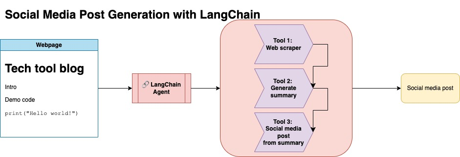
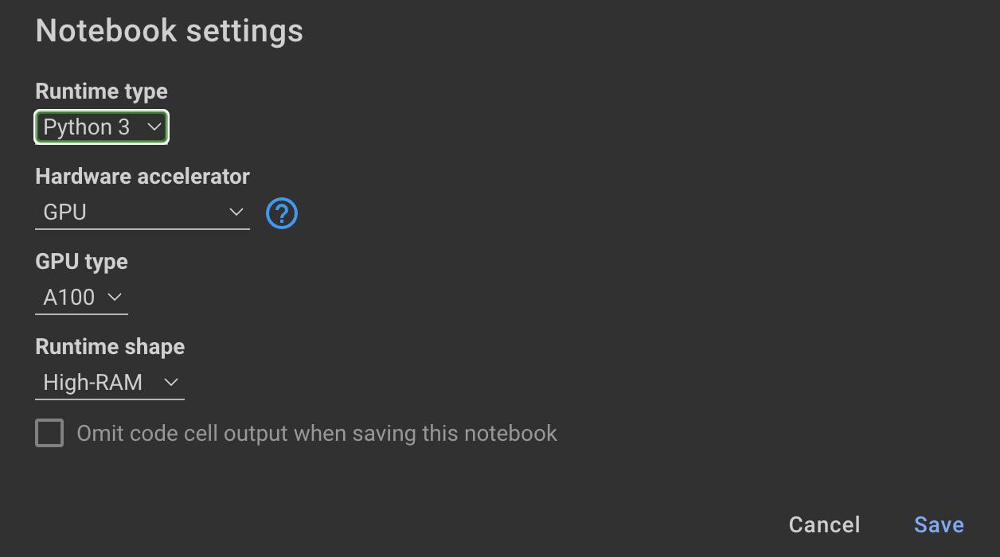

# Automating social media post from open source technical documentation

The purpose of this repository is to demonstrate how you can leverage two techniques when summarizing and transforming content from open source blogs to generate social media posts.

## Approaches taken 

### 1. LangChain 

You can find the relevant code for this approach under `llm-automation/blog_to_post.py` and `llm-automation/utils.py`



This approach assumes you have an OpenAI API key. The code in this repository uses GPT-4, but you can modify this to use other OpenAI models. 

### 2. Parameter Efficient Fine-Tuning with BLOOMZ-3B and LoRA (leverages deployment to Hugging Face)

This approach assumes you have a Hugging Face account, as well as read and write access tokens. Fine-tuning will require GPU and high RAM usage. 

This approach is using the synthetic data generated in step 1. 

You can find the relevant code for this approach under `notebooks/bloom_tuning.ipynb`.

The steps are as follows:

1. Download BLOOMZ-3B from Hugging Face via its model card `bigscience/bloomz-3b`. This is tokenizer for all of the BLOOM models.

2. We then apply post processing on the 8-bit model to enable training, freeze layers, and cast the layer-norm in float32 for stability. We cast output of the last layer in float32. 

3. Load a parameter efficient fine-tuning (PEFT) model and apply low-rank adapters (LoRA). 

4. Preprocess synthetic data via a prompt 

```
def generate_prompt(summary: str, social_media_post: str) -> str:
  prompt = f"### INSTRUCTION\nBelow is a summary of a post\
           and its corresponding social media post, please \
           write social media post for this blog.\
           \n\n### Summary:\n{summary}\n### Post:\n{social_media_post}\n"
  return prompt
```

The data can then be mapped

```
mapped_dataset = dataset.map(lambda samples: tokenizer(generate_prompt(samples['summary'], samples['social_media_post'])))
```

5. Used the `.Trainer` method from the `transformers` library on the mapped data. 


In this repository I combined both approaches to first curate synthetic data with the LangChain pipeline, and used the resulting dataset along with the techniques mentioned to fine-tune a model. 

### Data

I scraped data from [Numpy's JupyterBook](https://numpy.org/numpy-tutorials/index.html) and used LangChain and OpenAI API to generate a synthetic dataset consisting of the summary of the blog, along with a suggested social media post. 

Below is a sample data entry:

```
{
        "id": 1,
        "link": "https://numpy.org/numpy-tutorials/content/tutorial-air-quality-analysis.html",
        "summary": "Summary: Learn to perform air quality analysis using Python and NumPy in this tutorial! Discover how to import necessary libraries, build and process a dataset, calculate Air Quality Index (AQI), and perform paired Student's t-test on AQIs. We'll focus on the change in Delhi's air quality before and during the lockdown from March to June 2020.",
        "social_media_post": "🌏💨 Do you know how the lockdown affected Delhi's air quality? 🌫️🧐 Dive into our latest tutorial exploring air quality analysis using Python 🐍 and NumPy 🧪! Master the art of importing libraries 📚, building and processing datasets 📊, calculating the Air Quality Index (AQI) 📈, and performing the notorious Student's t-test on the AQIs 🔬. Let's discover the effects of lockdown on Delhi's air quality from March to June 2020 📆. Unravel the truth, and #BreatheEasy! 💚🌱 #Python #NumPy #AirQuality #DataScience #Tutorial #AQI #Delhi #Lockdown #EnvironmentalAwareness 🌍"
    }
```

This dataset was then uploaded to Hugging Face. You can find it via the model card [lgfunderburk/numpy-docs](https://huggingface.co/datasets/lgfunderburk/numpy-docs)

## Set up

Create a virtual environment

```
conda create --name postenv python==3.10
```

Activate

```
conda activate postenv
```

Clone repo and install dependencies

```
git clone https://github.com/lfunderburk/automate-tech-post.git
cd automate-tech-post/
pip install -r requirements.txt
```

## Executing LangChain pipeline

Create a `.env` file where you can store your OpenAI API key. The set your key within the `.env` file as follows:

```
OPENAI_API_KEY = <your-keyy>
```

You can execute the pipeline as follows:

```
python llm-automation/blog_to_post.py
```

## Fine-tuning a model

If you would prefer not to use OpenAI API and fine-tune a model instead, you can use the following colab notebook. 

### Assumptions:

Training the model requires GPUs and high RAM. If your local machine does not support this, you can use Colab Pro with the following specs:



The following notebook within this repository guides you through the steps: `notebooks/bloom_tuning.ipynb`.

## Using the fine-tuned model

If you simply want to use the model I fine-tuned with the synthetic dataset, you can open the notebook 

```
noebooks/use_fine_tuned_model.ipynb
```

The topic can be specified as follows:

```
  topic = "This blog post is a tutorial about using NumPy to solve static equilibrium problems in three-dimensional space. Readers will learn how to represent points, vectors, and moments with NumPy, find the normal of vectors, and use NumPy for matrix calculations. The tutorial covers the application of Newton's second law to simple examples of force vectors and introduces more complex cases involving reaction forces and moments. The post also discusses the use of NumPy functions in more varied problems, including kinetic problems and different dimensions."
        
```

The `make_inference` function will then use this topic to generate a sample social media post.