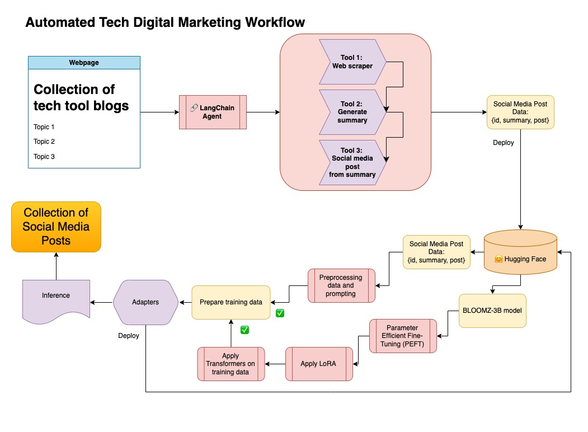

# Automating social media post from open source technical documentation

The purpose of this repository is to demonstrate how you can leverage two techniques when summarizing and transforming content from open source blogs to generate social media posts.

## Approaches taken 

### 1. LangChain 


This approach assumes you have an OpenAI API key. The code in this repository uses GPT-4, but you can modify this to use other OpenAI models. 

#### 2. Parameter Efficient Fine-Tuning with BLOOMZ-3B and LoRA (leverages deployment to Hugging Face)

This approach assumes you have a Hugging Face account, as well as read and write access tokens. Fine-tuning will require GPU and high RAM usage. 



In this notebook I combined both approaches to first curate synthetic data with the LangChain pipeline, and used the resulting dataset along with the techniques mentioned to fine-tune a model. 

### Data

I scraped data from [Numpy's JupyterBook](https://numpy.org/numpy-tutorials/index.html) and used LangChain and OpenAI API to generate a synthetic dataset consisting of the summary of the blog, along with a suggested social media post. 

Below is a sample data entry:

```
{
        "id": 1,
        "link": "https://numpy.org/numpy-tutorials/content/tutorial-air-quality-analysis.html",
        "summary": "Summary: Learn to perform air quality analysis using Python and NumPy in this tutorial! Discover how to import necessary libraries, build and process a dataset, calculate Air Quality Index (AQI), and perform paired Student's t-test on AQIs. We'll focus on the change in Delhi's air quality before and during the lockdown from March to June 2020.",
        "social_media_post": "🌏💨 Do you know how the lockdown affected Delhi's air quality? 🌫️🧐 Dive into our latest tutorial exploring air quality analysis using Python 🐍 and NumPy 🧪! Master the art of importing libraries 📚, building and processing datasets 📊, calculating the Air Quality Index (AQI) 📈, and performing the notorious Student's t-test on the AQIs 🔬. Let's discover the effects of lockdown on Delhi's air quality from March to June 2020 📆. Unravel the truth, and #BreatheEasy! 💚🌱 #Python #NumPy #AirQuality #DataScience #Tutorial #AQI #Delhi #Lockdown #EnvironmentalAwareness 🌍"
    }
```

## Set up

Create a virtual environment

```
conda create --name postenv python==3.10
```

Activate

```
conda activate postenv
```

Clone repo and install dependencies

```
git clone https://github.com/lfunderburk/automate-tech-post.git
cd automate-tech-post/
pip install -r requirements.txt
```

## Executing LangChain pipeline

Create a `.env` file where you can store your OpenAI API key. The set your key within the `.env` file as follows:

```
OPENAI_API_KEY = <your-keyy>
```

You can execute the pipeline as follows:

```
python llm-automation/blog_to_post.py
```

## Fine-tuning a model

If you would prefer not to use OpenAI API and fine-tune a model instead, you can use the following colab notebook. 

### Assumptions:

This approach leverages the following techniques and models:

###

Training the model requires GPUs and high RAM. If your local machine does not support this, you can use Colab Pro with the following specs:

